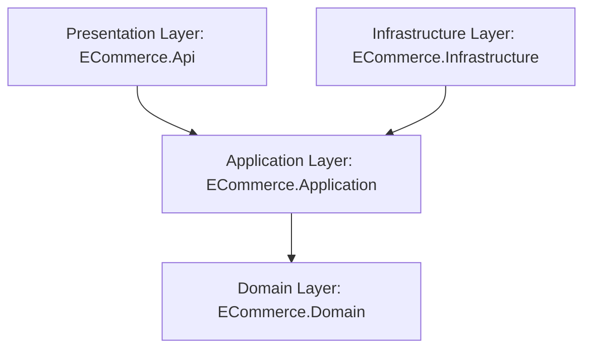

# Documentación Técnica del Proyecto ECommerce

Esta guía detalla la arquitectura, los patrones de diseño y el funcionamiento técnico de cada componente de la solución. Está diseñada para servir como material de preparación y defensa técnica del proyecto.

---

## 1. Arquitectura General: Clean Architecture

El proyecto sigue estrictamente los principios de **Clean Architecture** (Arquitectura Limpia), la cual organiza la base de código en círculos concéntricos de responsabilidad. La regla fundamental es: **las dependencias van siempre hacia adentro**. Las capas externas (como Base de Datos, Frameworks y API) dependen de las capas internas (Domain y Application), pero el núcleo nunca sabe nada del exterior.

### Proyectos en la Solución
1.  **`ECommerce.Domain` (Capa de Dominio):** El núcleo del sistema. Contiene entidades, objetos de valor y reglas de negocio puras. No tiene dependencias de bases de datos, APIs ni librerías de terceros (excepto herramientas del lenguaje).
2.  **`ECommerce.Application` (Capa de Aplicación):** Contiene los casos de uso del sistema. Define los flujos de negocio (qué pasa cuando se crea un producto o una orden), DTOs, validaciones y contratos (interfaces) que serán implementados por el exterior.
3.  **`ECommerce.Infrastructure` (Capa de Infraestructura):** Contiene las implementaciones técnicas y de acceso a datos (Entity Framework Core, SQLite, servicios de criptografía, generación de tokens JWT y middleware de excepciones).
4.  **`ECommerce.Api` (Capa de Presentación):** El punto de entrada HTTP. Contiene los controladores, la configuración del pipeline HTTP de ASP.NET Core, Swagger y la autenticación JWT.
5.  **`ECommerce.Tests` (Capa de Pruebas):** Suite de pruebas unitarias para validar las invariantes del dominio y los flujos de validación de la capa de aplicación.

---

## 2. Detalle de Capas y Archivos

### Capa 1: ECommerce.Domain (El Núcleo)

Esta capa sigue el patrón **Domain-Driven Design (DDD)** para evitar un "dominio anémico" (donde las entidades son simples bolsas de propiedades `get; set;` sin comportamiento).

#### A. Value Objects (Objetos de Valor)
Son objetos definidos por sus atributos en lugar de una identidad única (no tienen `Id`). Son **inmutables** y se auto-validan en su constructor.
*   **[Money.cs](file:///c:/Users/Docente/Desktop/Comercio%20Proyecto/ECommerce.Domain/ValueObjects/Money.cs):** Representa importes monetarios. Encapsula un valor (`decimal Amount`) y una moneda (`string Currency`). Previene valores negativos y contiene métodos matemáticos seguros como `Add()` y `Multiply()`.
*   **[Email.cs](file:///c:/Users/Docente/Desktop/Comercio%20Proyecto/ECommerce.Domain/ValueObjects/Email.cs):** Encapsula y valida el formato del correo electrónico en su constructor usando expresiones regulares.
*   **[ProductName.cs](file:///c:/Users/Docente/Desktop/Comercio%20Proyecto/ECommerce.Domain/ValueObjects/ProductName.cs):** Valida las reglas del nombre de un producto (obligatorio, longitud máxima de 200 caracteres).

#### B. Entities (Entidades de Dominio)
Tienen una identidad única (`Id`) y encapsulan las operaciones lógicas de negocio, protegiendo las invariantes (reglas que siempre deben ser verdaderas).
*   **[Product.cs](file:///c:/Users/Docente/Desktop/Comercio%20Proyecto/ECommerce.Domain/Entities/Product.cs):** Representa un artículo en catálogo. Expone el método `Reserve(quantity)` que reduce el stock si hay suficiente, o lanza una excepción de negocio.
*   **[Order.cs](file:///c:/Users/Docente/Desktop/Comercio%20Proyecto/ECommerce.Domain/Entities/Order.cs):** Representa un pedido. Expone `AddItem(product, quantity)` que reserva stock del producto, crea la línea de pedido y recalcula el `Total` de la orden de forma segura sumando objetos de tipo `Money`.
*   **[OrderItem.cs](file:///c:/Users/Docente/Desktop/Comercio%20Proyecto/ECommerce.Domain/Entities/OrderItem.cs):** Representa una línea individual de un pedido.
*   **[User.cs](file:///c:/Users/Docente/Desktop/Comercio%20Proyecto/ECommerce.Domain/Entities/User.cs):** Representa un usuario con su rol (`Admin` o `User`) y contraseña encriptada.

#### C. Domain Exceptions
*   **`DomainRuleException` y `InsufficientStockException`:** Excepciones personalizadas que se lanzan cuando se viola una regla de negocio. Esto evita que el sistema entre en estados inconsistentes.

---

### Capa 2: ECommerce.Application (Casos de Uso)

Implementa el patrón **CQRS** (Command Query Responsibility Segregation) utilizando **MediatR**. Separa las operaciones de escritura (Commands) de las de lectura (Queries).

#### A. Estructura de UseCases
Cada caso de uso está agrupado en carpetas de características (`Orders`, `Products`, `Auth`) y subcarpetas `Commands/` o `Queries/` para máxima organización.

##### Características de Products:
*   **[CreateProductCommand.cs](file:///c:/Users/Docente/Desktop/Comercio%20Proyecto/ECommerce.Application/UseCases/Products/Commands/CreateProductCommand.cs):** Comando (DTO de Entrada de MediatR) y Handler. Recibe los parámetros requeridos, crea la entidad `Product` (la cual valida sus propios campos) y la almacena.
*   **[DeleteProductCommand.cs](file:///c:/Users/Docente/Desktop/Comercio%20Proyecto/ECommerce.Application/UseCases/Products/Commands/DeleteProductCommand.cs):** Verifica si el producto existe y delega el borrado al repositorio.
*   **[GetAllProductsQuery.cs](file:///c:/Users/Docente/Desktop/Comercio%20Proyecto/ECommerce.Application/UseCases/Products/Queries/GetAllProductsQuery.cs):** Consulta para obtener todos los productos activos.
*   **[GetProductByIdQuery.cs](file:///c:/Users/Docente/Desktop/Comercio%20Proyecto/ECommerce.Application/UseCases/Products/Queries/GetProductByIdQuery.cs):** Consulta que recupera un producto por su `Id` y lanza una excepción si no existe.

##### Características de Orders:
*   **[CreateOrderCommand.cs](file:///c:/Users/Docente/Desktop/Comercio%20Proyecto/ECommerce.Application/UseCases/Orders/Commands/CreateOrderCommand.cs):** Orquesta la creación del pedido. Recupera los productos del repositorio, llama a `order.AddItem` (descontando stock), y guarda la orden en la base de datos de manera atómica.

#### B. Pipeline Behaviors (Filtros de Intercepción)
*   **[ValidationBehavior.cs](file:///c:/Users/Docente/Desktop/Comercio%20Proyecto/ECommerce.Application/Behaviors/ValidationBehavior.cs):** Implementa el patrón *Pipe and Filter*. Intercepta automáticamente cualquier comando o consulta enviado por MediatR. Busca si existe un validador (`AbstractValidator<T>`) para esa petición, lo ejecuta y, si encuentra errores de validación, interrumpe el flujo arrojando una excepción de validación *antes* de que llegue al Handler.

#### C. Validators (FluentValidation)
*   **[CreateProductValidator.cs](file:///c:/Users/Docente/Desktop/Comercio%20Proyecto/ECommerce.Application/Validators/Products/CreateProductValidator.cs):** Define reglas semánticas y mensajes de error específicos (ej. "El precio debe ser mayor a cero").

#### D. DTOs y Mappers
Desacoplan los contratos de red de las entidades internas.
*   **[CreateProductRequest.cs](file:///c:/Users/Docente/Desktop/Comercio%20Proyecto/ECommerce.Application/UseCases/Products/Dtos/CreateProductRequest.cs) y [ProductResponse.cs](file:///c:/Users/Docente/Desktop/Comercio%20Proyecto/ECommerce.Application/UseCases/Products/Dtos/ProductResponse.cs):** DTOs que definen exactamente qué datos entran y salen de la API de productos.
*   **[ProductMapper.cs](file:///c:/Users/Docente/Desktop/Comercio%20Proyecto/ECommerce.Application/UseCases/Products/ProductMapper.cs):** Clase estática que realiza el mapeo manual de manera ultra-eficiente entre la base de datos, DTOs y comandos.

---

### Capa 3: ECommerce.Infrastructure (Tecnología y Persistencia)

#### A. Entity Framework Core y SQLite
*   **[ApplicationDbContext.cs](file:///c:/Users/Docente/Desktop/Comercio%20Proyecto/ECommerce.Infrastructure/Persistence/ApplicationDbContext.cs):** Representa la base de datos en memoria/archivo.
*   **Configurations (Fluent API Mappings):**
    *   **[UserConfiguration.cs](file:///c:/Users/Docente/Desktop/Comercio%20Proyecto/ECommerce.Infrastructure/Persistence/Configurations/UserConfiguration.cs):** Define mapeos, índices únicos y el sembrado de datos inicial (Seed) de los usuarios de prueba.
    *   **Conversión de Objetos de Valor:** Mediante el método `.HasConversion()`, mapea de forma transparente los Value Objects en columnas de tipos primitivos soportados por SQLite (ej. el objeto `Money` se almacena como un simple `decimal` en la base de datos y se reconstruye automáticamente como `Money` al leerlo).

#### B. Repositories (Acceso a Datos)
*   **[ProductRepository.cs](file:///c:/Users/Docente/Desktop/Comercio%20Proyecto/ECommerce.Infrastructure/Repositories/ProductRepository.cs):** Implementa `IProductRepository` encapsulando las consultas de EF Core (`DbSet<Product>`).

#### C. Seguridad (Criptografía y Token JWT)
*   **[JwtTokenService.cs](file:///c:/Users/Docente/Desktop/Comercio%20Proyecto/ECommerce.Infrastructure/Services/JwtTokenService.cs):** Implementa la generación del Token JWT firmando digitalmente claims de identidad (ID, Nombre, Rol) mediante una clave secreta.
*   **BCrypt:** Los usuarios se almacenan con contraseñas encriptadas mediante la función de derivación de claves BCrypt, asegurando inmunidad ante ataques de diccionario.

#### D. Middleware Global de Excepciones
*   **[GlobalExceptionHandler.cs](file:///c:/Users/Docente/Desktop/Comercio%20Proyecto/ECommerce.Infrastructure/Middleware/GlobalExceptionHandler.cs):** Intercepta de manera global todas las excepciones arrojadas en cualquier capa. Si es una excepción de negocio (`NotFoundException`, `DomainRuleException`) o de validación, la traduce automáticamente a un formato estándar de la industria: **RFC 7807 (Problem Details)** con el código de estado HTTP adecuado (400, 404, 403, 401). Si es una excepción inesperada del sistema, retorna un error 500 ocultando detalles técnicos sensibles.

---

### Capa 4: ECommerce.Api (Presentación)

#### A. Controllers (Controladores del API)
*   **[ProductsController.cs](file:///c:/Users/Docente/Desktop/Comercio%20Proyecto/ECommerce.Api/Controllers/ProductsController.cs):**
    *   No tiene lógica de negocio ni dependencias a base de datos.
    *   Recibe solicitudes, inyecta solo `ISender` (MediatR), mapea objetos de entrada y retorna DTOs de salida.
    *   Implementa autorización por Roles mediante atributos (`[Authorize(Roles = "Admin")]`).
*   **[AuthController.cs](file:///c:/Users/Docente/Desktop/Comercio%20Proyecto/ECommerce.Api/Controllers/AuthController.cs):** Endpoint para autenticación de credenciales que retorna un token JWT.

---

## 3. Pruebas y Aseguramiento de Calidad (Testing)

El proyecto cuenta con dos niveles de pruebas para asegurar que los cambios no rompan la funcionalidad existente:

### Pruebas Unitarias y de Aplicación (`ECommerce.Tests`)
Ubicadas en el proyecto de pruebas. Se pueden ejecutar mediante el comando `.\.dotnet\dotnet.exe test`.
*   **Pruebas de Dominio:** Validan reglas internas como la restricción de crear importes monetarios (`Money`) con valores negativos, o realizar reservas (`Product.Reserve`) de cantidades mayores al stock disponible.
*   **Pruebas de Aplicación:** Validan las clases validadoras de FluentValidation (ej. asegurar que falla si el ID del usuario o producto es vacío, o la cantidad de ítems está fuera del rango permitido).

### Script de Integración E2E (`test_api.ps1`)
Ubicado en [scratch/test_api.ps1](file:///c:/Users/Docente/Desktop/Comercio%20Proyecto/scratch/test_api.ps1). Es un script en PowerShell que arranca pruebas contra la API en vivo. Simula un flujo de cliente completo:
1.  **Login de Usuario:** Envía credenciales de un usuario regular y verifica que el servidor responda con un token JWT válido.
2.  **Login de Administrador:** Autentica al Administrador y obtiene su respectivo token.
3.  **Creación de Productos:** Intenta registrar un producto en `/api/products` enviando el token JWT.
4.  **Validación de Roles (403 Forbidden):** Intenta eliminar el producto utilizando el token del usuario regular. El sistema debe denegar el acceso.
5.  **Ejecución de Eliminación por Admin:** Elimina el producto utilizando el token del Administrador (lo cual debe ser exitoso).
6.  **Creación de Orden (201 Created):** Crea una nueva orden de compra, verificando que se descuente el stock y que se persista la relación en la base de datos SQLite.
